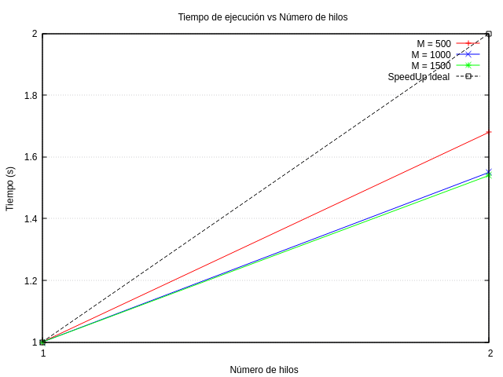

# Explicación de los Métodos Numéricos

## Problema físico

Se resuelve la ecuación de Laplace bidimensional para el potencial eléctrico \(\phi(x,y)\):

\[
\frac{\partial^2 \phi}{\partial x^2} + \frac{\partial^2 \phi}{\partial y^2} = 0
\]

Esta ecuación nos permite describir el comportamiento de un potencial eléctrico sobre una región donde no existen cargas libres (es decir, en el 
vacío o en materiales dieléctricos).

El dominio de este problema se encuentra  en una placa cuadrada de 10 cm × 10 cm, con dos barras internas que simulan las placas de un capacitor:
- Una barra se localiza cerca del borde izquierdo y se mantiene con potencial constante positivo $V_p$.
- Otra barra se encuentra cerca del borde derecho con potencial negativo $V_n$.

La longitud de ambas barras es de 6 cm, y están separadas a la misma distancia que su longitud, lo cual nos permite visualizar una configuración simétrica con respecto al eje horizontal.

Condiciones del problema:
  - En las condiciones del problemas donde no se especifique el potencial se asume que la condición de frontera tiene un valor inicial de cero, o 
    bien el potencial se actualiza iterativamente hasta converger.
  
---

## Métodos implementados

### 1. Método de relajación de Jacobi

Este método itera actualizando el potencial en cada punto de la malla usando el promedio de sus vecinos en la iteración anterior, manteniendo fijas las condiciones de frontera.

\[
\phi'(x, y) = \frac{1}{4}\left[\phi(x+a, y) + \phi(x-a, y) + \phi(x, y+a) + \phi(x, y-a)\right],
\]

La idea principal de este método es que se actualiza el valor del potencial eléctrico $\phi(x,y)$ en cada punto de la grilla como el promedio de los valores de sus vecinos adyacentes(arriba, abajo, izquierda, derecha) que se agarran de los datos iterativos anteriores, mientras mantenemos fijas las condiciones de frontera.

Esto se repite hasta que hayamos alcanzado una diferencia máxima entre dos iteraciones consecutivas, es lo que llamamos "el delta", y que este sea menor que una tolerancia escogida. Lo que nos indicará que hemos alcanzado la convergencia.

- Es sencillo pero convergencia lenta.
- Requiere dos matrices para mantener valores antiguos y nuevos.

---

### 2. Método de sobre-relajación de Jacobi (Jacobi modificado)

Se aplica un factor de sobre-relajación \(\omega\) para acelerar la convergencia, mezclando el valor nuevo calculado con el anterior:

\[
\phi'(x, y) = (1+\omega)\left[\frac{\phi(x+a, y) + \phi(x-a, y) + \phi(x, y+a) + \phi(x, y-a)}4\right] - \omega \phi (x,y).
\]

- Acelera la convergencia respecto al Jacobi estándar.
- Requiere ajuste del parámetro \(\omega\) para optimizar rendimiento.

Limitaciones: 
No siempre el método de Sobre-relajación de jacobi funcionará ya que este método es muy inestable para grillas cuadradas, esto sucede debido a que 
el método no actualiza los valores al instante como lo hace Gauss-Seidel, es por ello que al intentar la sobre-relajación los valores del error se 
amplifican, esto debido a las condiciones de frontera internas, como lo son las barras con un voltaje de $\pm 1$, como estan internamente esto 
permite la generación de una región central en la cual los errores circulan libremente sin ser frenados por los bordes rígidos. Debido a que este 
método se vuelv numéricamente inestable incluso para valores $\omega < 1$, esto nos demuestra que la estabilidad del método no solo va a depender 
del factor de relajación $\omega$, sino también de la geometría del problema y las condiciones de frontera.

Una forma de poder utilizar el método de sobre-relajación de jacobi, para una placa cuadrada con barras internas con voltaje, es utilizar el método 
de sobre-relajación sucesiva (SOR) lo que nos permite esto es hacer iteraciones paralelas sin necesidad de usar valores ya actualizados.

\[
\phi'(x, y) = (1 - \omega) \cdot \phi(x, y) + \frac{\omega}{4} \cdot \left( \phi(x+1, y) + \phi(x-1, y) + \phi(x, y+1) + \phi(x, y-1) \right)
\]

---

### 3. Método de Gauss-Seidel

En este método, la actualización del potencial en cada punto usa los valores más recientes disponibles (actualizados durante la misma iteración), 
mejorando la velocidad de convergencia frente a Jacobi. Esto facilita a la información propagarse más rápidamente a través de la grilla.

\[
\phi(x, y) \leftarrow \frac{\phi(x+a, y) + \phi(x-a, y) + \phi(x, y+a) + \phi(x, y-a)}{4}.
\]

- Solo se necesita una matriz.
- Mejor convergencia en menos iteraciones.
- Los valores recién calculados se utilizan en el mismo ciclo.

aunque este método es más rápido que Jacobi, la forma(orden) de actualizar los puntos puede influir en la estabilidad y el patrón de error.

---

### 4. Método de Gauss-Seidel en C++

Implementación equivalente al método de Gauss-Seidel en Python, pero usando C++ con `std::vector` y `std::tuple`.

- Permite una posible extensión para paralelización.
- Mejora en eficiencia y manejo de memoria para casos grandes.

---

## 5. Método de Gauss-Seidel en C++ con OpenMP (memoria compartida)

Paralelizamos el método de Gauss-Seidel utilizando OpenMP y un método conocido como Red-black ordering, esta técnica nos permite ordenar los puntos
de la grilla como si fuera un tablero de ajedrez (alternando "celdas rojas" y "negras"). Esto facilita que las actualizaciones no presenten conflictos de escritura en memoria compartida.

- paralelismo por hilos usando `#pragma omp parallel`.  
- Ordenamiento rojo-negro: actualizamos primero las celas $(i + j)$ par (rojas), luego las impares (negras). 

---

## 6. Método de Gauss-Seidel en C++ con MPI (memoria distribuida).

Este paralelismo distribuido utilizado con MPI (Message Passing Interface) a diferencia de OpenMP los datos estan divididos de manera que sus procesos son independientes y se comunican a través del intercambio de mensajes.

- Se divide la malla de forma horizontal y cada proceso calcula una porción.  
- Se implemente el método red-black ordering dentro de cada proceso.  
- Se realiza una reducción global del error con `MPI_ALLREDUCE`.

---

## 7. Condiciones de frontera y configuración de la grilla

- La placa se discretiza en una malla de \((M+1) \times (M+1)\) puntos.
- Dos barras verticales se colocan a 2 cm de cada borde lateral, con longitudes de 6 cm, y potenciales fijos \(V_p\) y \(V_n\).
- El resto de bordes y posiciones iniciales son 0.

---

## 8. Convergencia y criterio de parada

La iteración se detiene cuando la diferencia máxima absoluta entre iteraciones consecutivas es menor que una tolerancia dada.

---

## 9. Comparación y resultados

- El método de Gauss-Seidel converge más rápido que Jacobi.
- La sobre-relajación mejora aún más la velocidad si se escoge un \(\omega\) adecuado (por ejemplo, 0.9). Además de ello la forma geométrica y las condiciones de frontera son las adecuadas.
- La implementación en C++ es más eficiente y es base para paralelización futura.

## 10. Gráfica de escalabilidad
En esta sección incluiremos una gráfica de escalabilidad tomando en cuenta 2 hilos(threads) y para 3 tamaños de M distintos(M = 500, 1000, 1500).

## 11. Análisis
| M    | Hilos | Speedup real | Speedup ideal |
| ---- | ----- | ------------ | ------------- |
| 500  | 1     | 1.00         | 1             |
| 500  | 2     | 1.68         | 2             |
| 1000 | 1     | 1.00         | 1             |
| 1000 | 2     | 1.55         | 2             |
| 1500 | 1     | 1.00         | 1             |
| 1500 | 2     | 1.54         | 2             |

- Speedup ideal es la aceleración máxima teórica, que aumenta linealmente con el número de hilos (por ejemplo, con 2 hilos, el speedup ideal es 2).
- Speedup real muestra los valores obtenidos al correr el código en la computadora.

Observaciones
1. Aceleración sublineal:  
    En todos los casos, el speedup real con 2 hilos está por debajo del ideal (1.68, 1.55 y 1.54 en vez de 2). Esto es normal y esperado debido a:

      - Sobrecarga de gestión de hilos.
      - Costos de sincronización y comunicación entre threads.
      - Acceso a memoria compartida y posibles contenciones.

2. Mejor escalabilidad con problema pequeño (M=500): 
    El speedup para $𝑀 = 500$ con 2 hilos (1.68) es mayor que para $𝑀 = 1000$ y $𝑀 = 1500$ (alrededor de 1.55). Esto puede ser por:

      - El trabajo extra por manejar datos mayores y la sobrecarga paralela que no escala igual.
      - O bien, diferencias en la carga de trabajo por iteración (aunque usualmente problemas más grandes escalan mejor, puede depender de 
        implementación).

3. Escalabilidad limitada a 2 hilos: 
      Solo se tiene datos para 1 y 2 hilos. Con solo dos puntos es difícil trazar conclusiones sólidas. Idealmente, pruebas con más hilos ayudarían 
      a ver tendencias.
