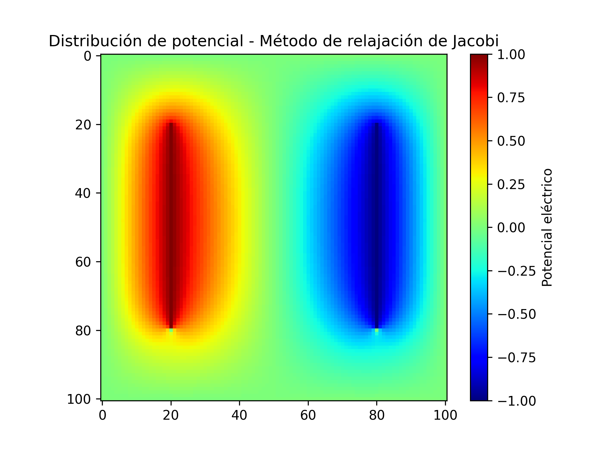

# Tutorial 

En esta parte nos centraremos en un enfonque orientado al aprendizaje. Aprenderemos como instalar las bibliotecas a utilizar y como implementar el 
método de relajación de Jacobi. Los métodos de sobre-relajación de Jacobi y Gauss-Seidel siguen un formato metodologíco similar, mientras que los 
implementados en C++ utilizan bibliotecas y procesos de compilación distintos.

# Requisitos previos
Antes de comenzar necesitamos tener instalado la siguiente biblioteca en nuestro entorno de python:
```bash
pip install numpy
pip install matplotlib
```
## Paso 1: Configuramos el entorno
Abrimos el editor de texto `vim` y creamos el nuevo archivo de python.
Por ejemplo, lo llamamos jacobi.py

## Paso 2: Importamos bibliotecas 
Comenzamos importando las bibliotecas requeridas para el código de Jacobi, sobre-relajación de Jacobi,
Gauss-seidel y Gauss-Seidel implementado en C++ y paralelizado con memoria compartida y distribuida.

```python
import numpy as np               # Biblioteca para operaciones numéricas eficientes, especialmente con arreglos y matrices
import matplotlib.pyplot as plt  # Módulo principal para graficar en 2D con una interfaz similar a MATLAB
import matplotlib.cm as cm       # Acceso a los mapas de colores (colormaps) predefinidos de Matplotlib

```

Librerías usadas para Gauss-seidel
```C++
#include <iostream>      // Biblioteca estándar para entrada/salida (cout, cerr, etc.)
#include <cmath>         // Biblioteca matemática (std::abs, std::pow, std::sqrt, etc.)
#include <vector>        // Contenedor dinámico tipo array (std::vector)
#include <tuple>         // Permite usar std::tuple para retornar múltiples valores

```

Librerías usadas para Gauss-Seidel Memoria compartida
```C++
#include <iostream>      // Biblioteca estándar para entrada/salida (cout, cerr, etc.)
#include <cmath>         // Biblioteca matemática (std::abs, std::pow, std::sqrt, etc.)
#include <vector>        // Contenedor dinámico tipo array (std::vector)
#include <tuple>         // Permite usar std::tuple para retornar múltiples valores
#include <sys/time.h>    // Biblioteca para manejo de tiempo con mayor precisión (gettimeofday)
#include <omp.h>         // Biblioteca para programación paralela con OpenMP
#include <iomanip>       // Biblioteca para manipular formato de salida (std::setprecision, std::fixed)

```


## Paso 3: Definimos las funciones que retornarán los métodos de Jacobi, Sobre-relajación de Jacobi, Gauss-Seidel, y Gauss-Seidel en memoria compartida y distribuida.

Método de relajación de Jacobi
```python
def jacobi_relaxation(M, V_p, V_n, tolerance):
    """
    Resuelve el potencial eléctrico en una placa cuadrada usando el método de relajación de Jacobi.

    Se modela la región cuadrada de tamaño `L x L`dividida en `M x M` puntos.
    Se tienen dos barras verticales que se colocan como condiciones de frontera internas:
    Una posee un potencial `V_p` y otra con `V_n`. La función itera hasta que el cambio
    máximo entre iteraciones sea menor que la `tolerance`.

    Args:
        M (int): Número de divisiones de la grilla (grilla de (M+1) x (M+1)).
        V_p (float): Voltaje aplicado en la barra positiva.
        V_n (float): Voltaje aplicado en la barra negativa.
        tolerance (float): Tolerancia para el criterio de convergencia.

    Returns:
        phi (ndarray): Matriz de 2 dimensiones con potenciales verticales dados por dos barras.
        its (int): Número de iteraciones realizadas.
        delta (float): Error máximo alcanzado en la última iteración.

    Examples:
        >>> phi, its, error = jacobi_relaxation(10, 100, 1.0, -1.0, 1e-5)
        >>> print(f"Iteraciones: {its}, Error final: {error:.2e}")
        Iteraciones: 1794, Error final: 9.99e-06
    """
    # Primero creamos los arreglos 2-dimensionales de la grilla
    # Vamos a necesitar dos según la regla de Jacobi
    # Note que usamos M+1, debido a que debemos contener la condición de frontera
    # phi contiene inicialmente los valores iniciales. Vamos a utilizar ceros.
    phi = np.zeros((M + 1, M + 1), dtype=float)
    # Ahora tenemos que colocar la condición inicial.
    # Recuerde accesos de listas en np.ndarray

    # Validamos que M sea mayor a 10
    if M <= 10:
        raise ValueError("El tamaño de la grilla (M) debe ser mayor a 10")

    # --- Calculamos la reposición dependiendo el tamaño de M
    fil_start = int(M * 0.2) # 2 cm desde arriba
    bar_len = int(M * 0.6)   # 6 cm longitud de la barra
    fil_end = fil_start + bar_len

    col_plus = int(M * 0.2)  # Voltaje positivo a 2 cm del borde izquierdo
    col_neg = col_plus + bar_len # Voltaje Negativo a 2 cm del borde derecho

    # Ahora tenemos que colocar la condición inicial.
    # Recuerde accesos de listas en np.ndarray
    phi[fil_start:fil_end, col_plus] = V_p  # Barra positiva
    phi[fil_start:fil_end, col_neg] = V_n    # Barra negativa

    # phiprime se necesita para la iteración
    phiprime = np.zeros((M + 1, M + 1), dtype=float)
    # Iteración de Jacobi
    delta = 1.0
    its = 0
    while delta > tolerance:
        # Calculamos la iteración
        its += 1
        for i in range(M + 1):
            for j in range(M + 1):
                # Condición de frontera
                if j == col_plus and fil_start <= i <= fil_end or j == col_neg and fil_start <= i <= fil_end:
                    phiprime[i, j] = phi[i,j]
                elif i == 0 or i == M or j == 0 or j == M:
                    phiprime[i, j] = phi[i, j]
                # Iteración principal
                else:
                # COMPLETE AQUÍ
                    phiprime[i,j] = 0.25 * (phi[i + 1, j] + phi[i - 1, j] + phi[i, j + 1] + phi[i, j - 1])
        # Calculamos la diferencia máxima con respecto a los valores anteriores
        delta = np.max(np.abs(phi - phiprime))
        # Ahora intercambiamos los arreglos para la nueva iteración
        # El nuevo phi es el phiprime
        temp = phi
        phi = phiprime
        # El nuevo phiprime es el phi viejo
        phiprime = temp

    return phi, its, delta
```

Método de Sobre-relajación de jacobi
```python
def jacobi_modified(L, M, V_p, V_n, omega, tolerance):
    """
    Aplicamos el método de Jacobi modificado con sobre-relajación para resolver
    el potencial eléctrico en una placa cuadrada con condiciones de frontera internas.

    Se modela la región cuadrada de tamaño `L x L`dividida en `M x M` puntos.
    Se tienen dos barras verticales que se colocan como condiciones de frontera internas:
    Una posee un potencial `V_p` y otra con `V_n`. Se actualiza iterativamente el potencial
    en el resto de la grilla usando un factor de sobre-relajación `omega` para acelerar la convergencia.

    Args:
        L (int): Tamaño físico de la placa cuadrada (dado en cm).
        M (int): Número de divisiones de la grilla (grilla de (M+1) x (M+1)).
        V_p (float): Voltaje aplicado en la barra positiva.
        V_n (float): Voltaje aplicado en la barra negativa.
        tolerance (float): Tolerancia para el criterio de convergencia.

    Returns:
        phi (ndarray): Matriz de 2 dimensiones con potenciales verticales dados por dos barras.
        its (int): Número de iteraciones realizadas.
        delta (float): Error máximo alcanzado en la última iteración.

    Examples:
        >>> phi, its, error = jacobi_modified(10, 100, 1.0, -1.0, 1e-5)
        >>> print(f"Iteraciones: {its}, Error final: {error:.2e}")
        error en la iteración.
    """
    # Primero creamos los arreglos 2-dimensionales de la grilla
    # Vamos a necesitar dos según la regla de Jacobi
    # Note que usamos M+1, debido a que debemos contener la condición de frontera
    # phi contiene inicialmente los valores iniciales. Vamos a utilizar ceros.
    phi = np.zeros((M + 1, M + 1), dtype=float)

    # Validamos que el tamaño M sea mayor a 10
    if M <= 10:
        raise ValueError("El tamaño de la grilla (M) deber ser mayor a 10")

    # --- Calculamos la reposición dependiendo del valor de M
    fil_start = int(0.2 * M) # 2 cm desde arriba
    vol_len = int(0.6 * M)   # 6 cm longitud de la barra
    fil_end = fil_start + vol_len

    col_plus = int(0.2 * M)  # voltaje positivo a 2 cm del borde izquierdo
    col_neg = col_plus + vol_len # Voltaje negativo a 2 cm del borde derecho

    # Ahora tenemos que colocar la condición inicial.
    # Recuerde accesos de listas en np.ndarray
    phi[fil_start:fil_end, col_plus] = V_p
    phi[fil_start:fil_end, col_neg] = V_n
    # phiprime se necesita para la iteración
    phiprime = np.zeros((M + 1, M + 1), dtype=float)
    # Iteración de Jacobi
    delta = 1.0
    its = 0
    while delta > tolerance:
        # Calculamos la iteración
        its += 1
        for i in range(M + 1):
            for j in range(M + 1):
                if j == col_plus and fil_start <= i <= fil_end or j == col_neg and fil_start <= i <= fil_end:
                    phiprime[i, j] = phi[i, j]
                # Condición de frontera
                elif i == 0 or i == M or j == 0 or j == M:
                    phiprime[i, j] = phi[i, j]
                # Iteración principal
                else:
                # COMPLETE AQUÍ
                    phiprime[i,j] = (1 + omega) * (0.25 * (phi[i + 1, j] + phi[i - 1, j] + phi[i, j + 1] + phi[i, j - 1])) - (omega * phi[i,j])
                    #phiprime[i,j] = (1 - omega) * phi[i,j] + (omega / 4) * (phi[i + 1, j] + phi[i - 1, j] + phi[i, j + 1] + phi[i, j - 1])
        # Calculamos la diferencia máxima con respecto a los valores anteriores
        delta = np.max(np.abs(phi - phiprime))
        # Ahora intercambiamos los arreglos para la nueva iteración
        # El nuevo phi es el phiprime
        temp = phi
        phi = phiprime
        # El nuevo phiprime es el phi viejo
        phiprime = temp
    return phi, its, delta
```

Método de Gauss-Seidel

```python
def gauss_seidel(M, V_p, V_n, tolerance):
    """
    Resuelve el potencial eléctrico en una placa cuadrada usando el método de Gauss-seidel.

    Se modela la región cuadrada de tamaño `L x L`dividida en `M x M` puntos.
    Se tienen dos barras verticales que se colocan como condiciones de frontera internas:
    Una posee un potencial `V_p` y otra con `V_n`. La función itera hasta que el cambio
    máximo entre iteraciones sea menor que la `tolerance`.

    Args:
        L (int): Tamaño físico de la placa cuadrada (dado en cm).
        M (int): Número de divisiones de la grilla (grilla de (M+1) x (M+1)).
        V_p (float): Voltaje aplicado en la barra positiva.
        V_n (float): Voltaje aplicado en la barra negativa.
        tolerance (float): Tolerancia para el criterio de convergencia.

    Returns:
        phi (ndarray): Matriz de 2 dimensiones con potenciales verticales dados por dos barras.
        its (int): Número de iteraciones realizadas.
        delta (float): Error máximo alcanzado en la última iteración.

    Examples:
        >>> phi, its, error = jacobi_relaxation(10, 100, 1.0, -1.0, 1e-5)
        >>> print(f"Convergencia alcanzada en {its} iteraciones con error de {error:.2e}")
        Convergencia alcanzada en 1125 iteraciones con error de 9.97e-06
    """
    # Primero creamos el arreglo 2-dimensionales de la grilla
    # Note que usamos M+1, debido a que debemos contener la condición de frontera
    # phi contiene inicialmente los valores iniciales. Vamos a utilizar ceros.
    phi = np.zeros((M + 1, M + 1), dtype=float)

    # Validamos que M sea mayor que 10
    if M <= 10:
        raise ValueError("El tamaño de la grilla (M) debe ser mayor a 10")

    # --- Calculamos la reposición dependiendo del valor de M
    fil_start = int(M * 0.2) # 2 cm desde arriba
    vol_len = int(M * 0.6)   # 6 cm longitud de la barra
    fil_end = fil_start + vol_len

    col_plus = int(M * 0.2)  # voltaje positivo a 2 cm del borde izquierdo
    col_neg = col_plus + vol_len # Voltaje negativo a 2 cm del borde derecho

    # Ahora tenemos que colocar la condición inicial.
    # Recuerde accesos de listas en np.ndarray
    phi[fil_start:fil_end, col_plus] = V_p
    phi[fil_start:fil_end, col_neg] = V_n
    # Vamos a guardar una copia para evaluar el error
    phi_copy = phi.copy()
    # Iteración de Gauss-Seidel
    delta = 1.0
    its = 0
    while delta > tolerance:
        # Calculamos la iteración
        its += 1
        for i in range(1, M):
            for j in range(1, M):
                # Condición de frontera
                # En este caso, en la frontera los valores no se modifican
                if fil_start <= i <= fil_end and (j == col_plus or j == col_neg):
                    continue
                # Iteración principal
                else:
                    # COMPLETE AQUÍ
                    phi[i,j] = 0.25 * (phi[i + 1, j] + phi[i - 1, j] + phi[i, j + 1] + phi[i, j - 1] )
        # Calculamos la diferencia máxima con respecto a los valores anteriores
        delta = np.max(np.abs(phi - phi_copy))
        # Copiamos los valores de la nueva iteración
        phi_copy = phi.copy()

    return phi, its, delta
```

Método de Gauss-Seidel Memoria Compartida
```C++
double seconds(){
  struct timeval tmp;
  double sec;
  gettimeofday( &tmp, (struct timezone *)0 );
  sec = tmp.tv_sec + ((double)tmp.tv_usec)/1000000.0;

  return sec;
}

/**
 * @brief Resuelve el potencial eléctrico en una placa cuadrada con método Gauss-Seidel usando red-black ordering y OpenMP.
 *
 * Se impone una grilla de tamaño `M x M` sobre la placa, con dos barras verticales:
 * una con voltaje positivo `V_p` y otra con voltaje negativo `V_n`. 
 * El algoritmo aplica el método de Gauss-Seidel con ordenamiento red-black en paralelo.
 *
 * @param M Número de divisiones de la grilla (debe ser mayor a 10)
 * @param V_p Voltaje positivo aplicado
 * @param V_n Voltaje negativo aplicado
 * @param tolerance Tolerancia para el criterio de convergencia
 * @param num_procs Referencia donde se guardará el número de procesos/hilos usados
 * @return std::tuple<int, double> Número de iteraciones realizadas y error final
 */

std::tuple<int, double> gaussseidel(int M, double V_p, double V_n, double tolerance, int &num_procs){
  // Creamos un arreglo de 2-dimensiones usando std::vector
  using Matrix = std::vector<std::vector<double>>;
  Matrix phi(M + 1, std::vector<double>(M + 1, 0.0));

  // ---- Validar que M sea mayor a 10
  if (M <= 10){
    throw std::runtime_error("El tamaño de la grilla (M) debe ser mayor a 10");
  }

  // ---- Calcular la reposición dependiendo del valor de M
  // ---- Posiciones expresadas en índices de grilla
  // ---- usamos static_cast<int> para convertir de double a int de forma segura
  int fil_start = static_cast<int>(M * 0.2);        // 2 cm desde arriba
  int bar_len = static_cast<int>(M * 0.6);          // longitud de la barra 6 cm
  int fil_end = fil_start + bar_len;

  int col_plus = static_cast<int>(M * 0.2);         // Voltaje positivo a 2 cm del borde izquierdo
  int col_neg = col_plus + bar_len;                 // Voltaje negativo a 2 cm del borde derecho

  // Colocamos las posiciones iniciales
  for (int i = fil_start; i < fil_end; ++i){
    phi[i][col_plus] = V_p;
    phi[i][col_neg] = V_n;
  }

  // Guardamos una copia
  Matrix phi_copy = phi;

  // Iteración de Gauss-seidel
  double delta = 1.0;
  int its = 0;
  while (delta > tolerance){
    its += 1;
    #pragma omp parallel 
    {
      #pragma omp single
      {
        num_procs = omp_get_num_threads();
      }
      /* --- Implementar el método de red-black ordering
       * Este método consiste en colorear todo el dominio 
       * de la grilla como si fuera un tablero de ajedrez:
       * en celdas rojas y negras
       * R N R N 
       * N R N R 
       * R N R N 
       * N R N R
       * La clave de este método es que cada paso iremos 
       * actualizando las celdas rojas primero (usando las
       * negras) y luego las celdas negras (usando las rojas
       * recién actualizadas). */

      // Actualizamos las celdas rojas
      #pragma omp for collapse(2)
      for (int i = 1; i < M; ++i){
        for (int j = 1; j < M; ++j){
          if ((i + j) % 2 == 0){
            if ((fil_start <= i && i <= fil_end) && (j == col_plus || j == col_neg)){
              continue;
            }
            else{
              phi[i][j] = 0.25 * (phi[i + 1][j] + phi[i - 1][j] + phi[i][j + 1] + phi[i][j - 1]);
            }
          }
        }
      }

      // Actualizamos las celdas negras
      #pragma omp for collapse(2)
      for (int i = 1; i < M; ++i){
        for (int j = 1; j < M; ++j){
          if ((i + j) % 2 == 1){
            if ((fil_start <= i && i <= fil_end) && (j == col_plus || j == col_neg)){
              continue;
            }
            else{
              phi[i][j] = 0.25 * (phi[i + 1][j] + phi[i - 1][j] + phi[i][j + 1] + phi[i][j -1]);
            }
          }
        }
      }
    }

    // Calculamos la diferencia máxima con respecto a los valores anteriores
    delta = 0.0;
    #pragma omp parallel reduction(max:delta)
    {
      #pragma omp for
      for (int i = 0; i <= M; ++i){
        for (int j = 0; j <= M; ++j){
          double diferencia = std::abs(phi[i][j] - phi_copy[i][j]);
          if (diferencia > delta){
            delta = diferencia;
          }
        }
      }
    }

    // Copiamos los valores de la nueva iteración

    phi_copy = phi;
  }

  //std::cout << "phi[50][25] = " << phi[50][25] << std::endl;
  return std::make_tuple(its, delta);
}
```
Método de Gauss-Seidel Memoria Distribuida
```C++
double seconds(){
  struct timeval tmp;
  gettimeofday(&tmp, nullptr);
  return tmp.tv_sec + tmp.tv_usec * 1e-6;
}

// Función principal paralela usando memoria distribuida
/**
 * @brief Resuelve el potencial eléctrico en una placa usando el método de Gauss-Seidel con ordenamiento red-black y MPI.
 *
 * Se divide la grilla de tamaño `M x M` entre los procesos disponibles.
 * Cada proceso calcula una porción del dominio y colabora usando comunicación punto a punto.
 * Se usan halos (bordes fantasma) para compartir información entre procesos vecinos.
 * 
 * @param L Longitud de la placa (no se usa en el cálculo actual)
 * @param M Número de divisiones en la grilla (resolución espacial)
 * @param V_p Voltaje positivo aplicado a una barra vertical
 * @param V_n Voltaje negativo aplicado a otra barra vertical
 * @param tolerance Tolerancia para el criterio de convergencia (máximo delta permitido)
 * @return std::tuple<int, double> Par con número de iteraciones realizadas y el error final (delta)
 */

// Función principal paralela usando memoria distribuida
std::tuple<int, double> gaussseidel_mpi(int L, int M, double V_p, double V_n, double tolerance){
  using Matrix = std::vector<std::vector<double>>;
  int rank, size;
  MPI_Comm_rank(MPI_COMM_WORLD, &rank);
  MPI_Comm_size(MPI_COMM_WORLD, &size);

  if (M <= 10) throw std::runtime_error("M > 10");

  // Determinar cuántas filas maneja cada proceso
  int local_rows = M / size;
  int rem = M % size;
  int start = rank * (local_rows) + std::min(rank, rem) + 1;
  local_rows += (rank < rem ? 1 : 0);
  int end = start + local_rows - 1; // inclusive

  // Creamos matriz local con halos (2 filas extra)
  int cols = M + 1;
  Matrix phi(local_rows + 2, std::vector<double>(cols, 0.0));
  Matrix phi_copy = phi;

  // Calculamos posición de barras globales
  // ---- usamos static_cast<int> para convertir de double a int de forma segura
  int fil_start = static_cast<int>(M * 0.2);        // 2 cm desde arriba
  int bar_len = static_cast<int>(M * 0.6);          // longitud de la barra 6 cm
  int fil_end = fil_start + bar_len;

  int col_plus = static_cast<int>(M * 0.2);         // Voltaje positivo a 2 cm del borde izquierdo
  int col_neg = col_plus + bar_len;                 // Voltaje negativo a 2 cm del borde derecho

  // Inicialización: cada fila (global i = start..end)
  for (int gi = start; gi <= end; ++gi){
    if (gi >= fil_start && gi < fil_end){
      phi[gi - start + 1][col_plus] = V_p;
      phi[gi - start + 1][col_neg]  = V_n;
    }
  }

  double delta = 1.0;
  int its = 0;

  while (delta > tolerance){
    its += 1;

    // -- Intercambio halo superior/inferior
    MPI_Request active_reqs[4];
    int num_reqs = 0;

    if(rank > 0){
      MPI_Irecv(&phi[0][0], cols, MPI_DOUBLE, rank - 1, 0, MPI_COMM_WORLD, &active_reqs[num_reqs++]);
      MPI_Isend(&phi[1][0], cols, MPI_DOUBLE, rank - 1, 1, MPI_COMM_WORLD, &active_reqs[num_reqs++]);
    }
    if(rank < (size - 1)){
      MPI_Irecv(&phi[local_rows + 1][0], cols, MPI_DOUBLE, rank + 1, 1, MPI_COMM_WORLD, &active_reqs[num_reqs++]);
      MPI_Isend(&phi[local_rows][0], cols, MPI_DOUBLE, rank + 1, 0, MPI_COMM_WORLD, &active_reqs[num_reqs++]);
    }

    MPI_Waitall(num_reqs, active_reqs, MPI_STATUSES_IGNORE);

    // --- Actualizamos celdas rojas
    for (int i = 1; i <= local_rows; ++i){
      for (int j = 1; j < M; ++j){
        int gi = start + i -1; // gi = global i
        if ((gi + j) % 2 == 0){
          if ((fil_start <= gi && gi <= fil_end) && ( j == col_plus || j == col_neg)){
            continue;
          }
          else{
            phi[i][j] = 0.25 * (phi[i + 1][j] + phi[i - 1][j] + phi[i][j  + 1] + phi[i][j - 1]);
          }
        }
      }
    }

    // --- Actualizamos las celdas negras
    for (int i = 1; i <= local_rows; ++i){
      for (int j = 1; j < M; ++j){
        int gi = start + i - 1;
        if ((gi + j) % 2 == 1){
          if ((fil_start <= gi && gi <= fil_end) && (j == col_plus || j == col_neg)){
            continue;
          }
          else{
            phi[i][j] = 0.25 * (phi[i + 1][j] + phi[i - 1 ][j] + phi[i][j + 1] + phi[i][j - 1]);
          }
        }
      }
    }
    MPI_Barrier(MPI_COMM_WORLD); // Sincronizamos los colores

    // --- Cálculo del delta local
    delta = 0.0;
    for (int i = 1; i <= local_rows; ++i){
      for (int j = 1; j <= M; ++j){
        double diferencia = std::abs(phi[i][j] - phi_copy[i][j]);
        if (diferencia > delta){
          delta = diferencia;
        }
      }
    }

    // --- Reducción global del delta
    MPI_Allreduce(MPI_IN_PLACE, &delta, 1, MPI_DOUBLE, MPI_MAX, MPI_COMM_WORLD);

    // --- Copiamos los valores de la nueva iteración
    phi_copy = phi;
  }

  // --- Imprimir el proceso que posee la fila 50
  int gi_target = 50;
  if (start <= gi_target && gi_target <= end){
    int li = gi_target - start + 1; 
    std::cout << "phi[50][25] = " << phi[li][25] << std::endl;
  }

  return std::make_tuple(its, delta);
}
```

## Paso 4: Llamado a la función
En esta parte escribimos el llamado a la función para almacenar los resultados en nuevas variables y poder realizar la impresión en pantalla

- Llamado a la función del Método de Jacobi
  ```python
  jacobi_vals, iterations, error = jacobi_relaxation(10, 100, 1.0, -1.0, 1e-5)
  print(f"Convergencia alcanzada en {iterations} iteraciones con error {error:.2e}")
  ```

- Llamado a la función del Método de Sobre-relajación de Jacobi
  ```python
  jacobiModified_vals, iterations, error = jacobi_modified(10, 100, 1.0, -1.0, 0.9, 1e-5)
  print(f"Convergencia alcanzada en {iterations} iteraciones con error {error}")
  ```
- Llamado a la función del método de Gauss-Seidel
  ```python
  gaussSeidel_vals, iterations, error = gauss_seidel(10, 100, 1.0, -1.0, 1e-5)
  print(f"Convergencia alcanzada en {iterations} iteraciones con error de {error:.2e}")
  # print("Valores grilla phi[50][25] ", gaussSeidel_vals[50][25])
  ```
- Llamado a la función del método de Gauss-Seidel memoria compartida
  ```C++  
  int main(){
  int iteraciones;
  double error;

  int num_procs;

  std:: cout.precision(10); // configuramos la salida de decimales con una precision de 10 números
  // iniciamos el temporizador
  double time_1 = seconds();

  std::tie(iteraciones, error) = gaussseidel(500, 1.0, -1.0, 1e-5, num_procs);
  std::cout << "Convergencia alcanzada en " << iteraciones << " iteraciones con error " << error << std::endl;


  // Finalizamos el temporizador
  double time_2 = seconds();

  std::cout << "Numero de procesos: " << num_procs << std::endl;
  std::cout << std::fixed << std::setprecision(4);
  std::cout << "Tiempo de ejecución: " << time_2 - time_1 << " segundos" << std::endl;

  return 0;
  }
  ```

Llamado a la función de Gauss-Seidel memoria distribuida
  ```C++
  int main(int argc, char**argv){
  MPI_Init(&argc,&argv);
  int rank; MPI_Comm_rank(MPI_COMM_WORLD,&rank);

  double t0 = seconds();
  auto [its, delta] = gaussseidel_mpi(10, 100, 1.0, -1.0, 1e-5);
  double t1 = seconds();

  if(rank == 0){
    std::cout<<"Iteraciones: "<<its<<" error: "<<delta<<"\n";
    std::cout<<"Tiempo MPI: "<<(t1-t0)<<" s\n";
  }

  MPI_Finalize();
  return 0;
  }
  ```

## Paso 5: Ejecutamos el código
guardamos el archivo de jacobi.py, Sobre-relajación de Jacobi, Gauss-Seidel, Gauss-Seidel memoria compartida, memoria distribuida y lo ejecutamos
- primero añadimos permisos de ejecución:
```bash
chmod +x jacobi.py
chmod +x jacobi_modified.py
chmod +x gauss_seidel.py
```
- Segundo ejecutamos el código
```bash
./jacobi.py
./jacobi_modified.py
./gauss_seidel.py
```
- para ejecutar los código .cpp se hacen de la siguiente manera:
  - para gaussseidel.cpp
    ```bash
    g++ gaussseidel.cpp -o gaussseidel
    g++ -fopenmp gaussseidelmc.cpp -o gaussseidelmc
    mpicxx gaussseidelmd.cpp -o gaussseidelmd.x
    ```
  - para ejecutar siguiendo el orden anterior
    ```bash
    ./gaussseidel
    export OMP_NUM_THREADS=N && ./gaussseidelmc
    mpirun -np X ./gaussseidelmd.x
    ```
      - Donde N es el número de hilos a utilizar.
      - Donde X es el número de procesos a utilizar.

## Paso 6: Graficar
Escribimos el código a utilizar para realizar la gráfica esperada
Para los métodos escritos en python la gráfica es similar por ende solo presentamos un código e imagen.
```python
plt.imshow(jacobi_vals, cmap='jet')  # Aplicar colormap explícitamente
plt.colorbar(label='Potencial eléctrico')  # Añadir barra de color con etiqueta
plt.title('Distribución de potencial - Método de relajación de Jacobi')
plt.savefig('Jacobi.png', dpi=300)  # Guarda la imagen con buena resolución
plt.show()
```
El código utilizado para gráficar los datos de SpeedUp vs Número de Hilos.
```gnuplot
set title "Tiempo de ejecución vs Número de hilos"
set xlabel "Número de hilos"
set ylabel "Tiempo (s)"
set key top right
set grid
set xtics 1
set style data linespoints

plot \
    "SpeedUpM500.dat" using 1:2 title "M = 500" lt rgb "red", \
    "SpeedUpM1000.dat" using 1:2 title "M = 1000" lt rgb "blue", \
    "SpeedUpM1500.dat" using 1:2 title "M = 1500" lt rgb "green", \
    "SpeedUpM500.dat" using 1:3 title "SpeedUp ideal" lt rgb "black" dt 2
```
Este código nos permite tomar los datos de las columnas 1 y 2, que son los hilos y el SpeedUp para realizar una gráfica que contenga
las tres líneas creadas por los diferentes tamaños de M, y añadiendole la Gráfica ideal con los valores de las columnas 1 y 3, que son los hilos 
utilizados con el valor Ideal del SpeedUp.

Para el método de Gauss-Seidel memoria compartida y distribuida se presento la gráfica de escalabilidad en el apartado de:
- [Explicación](explanation.md)
### Gráfica:

